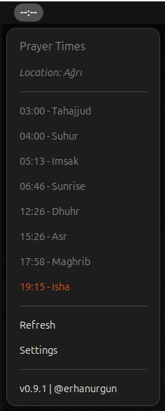
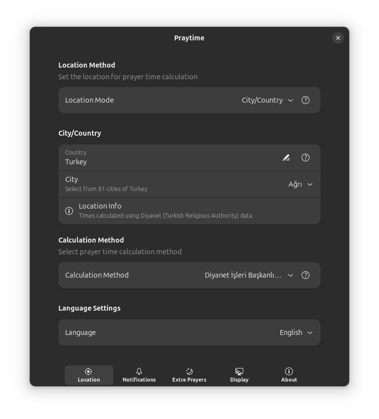
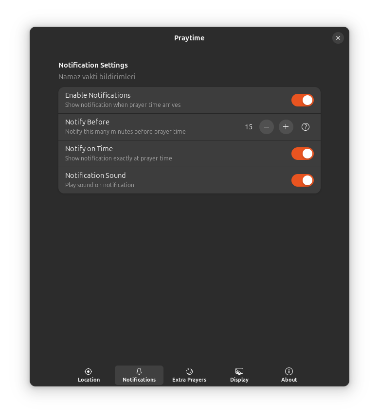
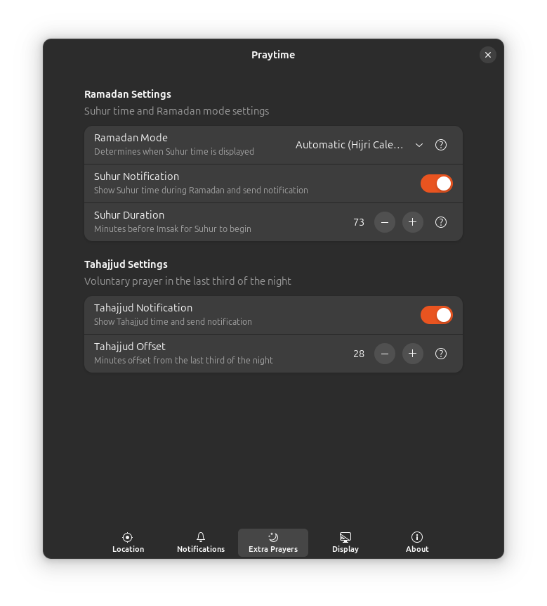
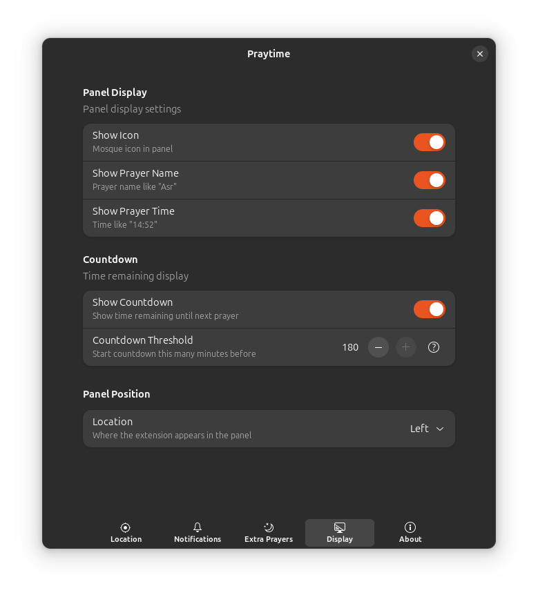

# Praytime - GNOME Shell Extension

> [Turkce dokumantasyon](README.md)

Prayer times notification and panel display extension for GNOME Shell.

## Screenshots

### Panel Menu



### Settings

| | |
|:---:|:---:|
| <br>**Location Settings** | <br>**Notification Settings** |
| <br>**Extra Prayers** | <br>**Display Settings** |

## Features

- Next prayer time and countdown on GNOME panel
- 6 prayer times: Fajr, Sunrise, Dhuhr, Asr, Maghrib, Isha
- Turkish and English language support (automatic or manual selection)
- Worldwide location support (city/country or coordinate-based)
- 24 calculation methods (Diyanet, ISNA, MWL, Umm Al-Qura, etc.)
- Turkish cities dropdown (81 provinces) for Turkey
- On-time and advance prayer notifications
- Tahajjud and Suhur prayer support (automatic Ramadan detection)
- Clean Architecture design

## Requirements

- GNOME Shell 46, 47, or 48
- Internet connection (for API access)

## Quick Start

```bash
# Clone the project
git clone https://github.com/erhanurgun/LINUX-ubuntu-gnome-praytime-extension.git
cd LINUX-ubuntu-gnome-praytime-extension

# Install and run
./scripts/install.sh
```

## Installation

### Method 1: Script (Recommended)

```bash
./scripts/install.sh
```

### Method 2: Manual Installation

```bash
# Copy to extensions directory
mkdir -p ~/.local/share/gnome-shell/extensions/praytime@erho.dev
cp -r extension.js prefs.js metadata.json stylesheet.css schemas src icons sounds \
    ~/.local/share/gnome-shell/extensions/praytime@erho.dev/

# Compile schemas
glib-compile-schemas ~/.local/share/gnome-shell/extensions/praytime@erho.dev/schemas/

# Enable
gnome-extensions enable praytime@erho.dev
```

### Method 3: GNOME Extensions Website (Coming Soon)

Will be available on [extensions.gnome.org](https://extensions.gnome.org) after approval.

## Usage

After enabling the extension, the next prayer time and countdown appear on the GNOME Shell panel.

### Panel Display

```
Dhuhr 12:30 (2:15:30)
```

- **Dhuhr**: Next prayer name
- **12:30**: Prayer time
- **(2:15:30)**: Remaining time (hours:minutes:seconds)

### Location Setup

1. Open extension settings (`gnome-extensions prefs praytime@erho.dev`)
2. Go to the **Location** page
3. Choose location mode:
   - **City/Country**: Enter country name and city (Turkey uses dropdown for 81 provinces)
   - **Latitude/Longitude**: Enter coordinates (get from maps.google.com)
4. Select calculation method (default: Diyanet)

### Language

The extension supports Turkish and English. Language can be set to:
- **Auto**: Follows system language
- **Turkish**: Forces Turkish UI
- **English**: Forces English UI

## Settings

### Location Settings

- **Location Mode**: City/Country or Latitude/Longitude
- **Country**: Country name (free text)
- **City**: City selection (dropdown for Turkey, text input for others)
- **Calculation Method**: 24 methods available (Diyanet, ISNA, MWL, etc.)

### Notification Settings

- **Enable Notifications**: Toggle notification display
- **Notify Before**: Minutes before prayer time to send notification
- **Notify On Time**: Send notification when prayer time arrives

### Extra Prayers

- **Tahajjud**: Night prayer (last third of the night)
- **Suhur**: Pre-dawn meal time (configurable minutes before Fajr)
- **Ramadan Mode**: Auto (detects Hijri month), Always On, or Off

### Display Settings

- **Show Countdown**: Show remaining time on panel
- **Panel Position**: Left, Center, or Right
- **Language**: Auto, Turkish, or English

## Development

### Scripts

| Script                     | Description                                    |
|----------------------------|------------------------------------------------|
| `./scripts/install.sh`     | Install and enable the extension               |
| `./scripts/uninstall.sh`   | Remove the extension                           |
| `./scripts/dev.sh`         | Sync changes and reload                        |
| `./scripts/dev.sh --watch` | Auto sync (file watching)                      |
| `./scripts/clean.sh`       | Clean cache and artifacts                      |
| `./scripts/build.sh`       | Create zip for extensions.gnome.org            |
| `./scripts/logs.sh`        | Show GNOME Shell logs                          |

### Running Tests

```bash
cd tests

# Run all tests
./run-tests.sh

# Parallel execution (fastest)
./run-tests.sh -p

# Quick mode (summary only)
./run-tests.sh -q

# Single test
./run-tests.sh PrayerTime

# Category tests
./run-tests.sh domain
```

### Test Structure

| Category | Tests | Description |
|----------|-------|-------------|
| Domain | PrayerTime, Location, PrayerSchedule, NullHandling, Constants | Business logic models |
| Infrastructure | LocationProvider | External system integrations |
| Application | TimerManager, NotificationScheduler, PrayerTimeService | Service layer |

## Project Structure

```
praytime@erho.dev/
+-- metadata.json           # Extension metadata
+-- extension.js            # Main extension class
+-- prefs.js                # Settings window
+-- stylesheet.css          # UI styles
+-- schemas/                # GSettings schemas
+-- icons/                  # Extension icons
+-- sounds/                 # Notification sounds
+-- po/                     # Translation files (.po/.pot)
+-- scripts/                # Development scripts
+-- tests/                  # Unit tests
+-- src/
    +-- config/             # Constants and configuration
    +-- domain/             # Business logic models
    +-- infrastructure/     # External systems (API, location)
    +-- application/        # Service layer
    +-- presentation/       # UI components
    +-- i18n/               # Internationalization
```

## API

This extension uses the [Aladhan Prayer Times API](https://aladhan.com/prayer-times-api).

## Contributing

1. Fork the repository
2. Create a feature branch (`git checkout -b feature/new-feature`)
3. Commit your changes (`git commit -m 'Add new feature'`)
4. Push to branch (`git push origin feature/new-feature`)
5. Open a Pull Request

## License

MIT License

## Developer

[@erhanurgun](https://github.com/erhanurgun) - [erho.me](https://erho.me)

## Version History

See [CHANGELOG.md](CHANGELOG.md) for detailed change history.
